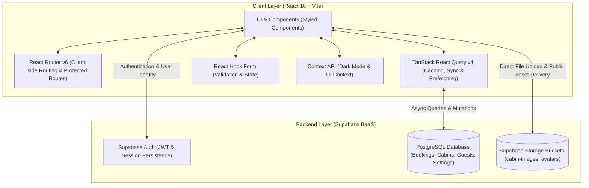

<div align="center">

  

  # 🌲 The Wild Oasis

  **A modern, full-featured luxury cabin management and internal hotel operations dashboard.**

  [](https://reactjs.org/)
  [](https://vitejs.dev/)
  [](https://supabase.com/)
  [](https://tanstack.com/query/v4)
  [](https://styled-components.com/)
  [](LICENSE)

  [Explore Features](#-key-features) • [Architecture](#-system-architecture) • [Workflows & Diagrams](#-workflows--diagrams) • [Database Schema](#-database-schema) • [Getting Started](#-getting-started)

</div>

---

## 📖 Overview

**The Wild Oasis** is an internal enterprise-grade management application built for hotel staff and boutique retreat operators. It automates and streamlines day-to-day operations for luxury cabin rentals, including guest bookings, check-in and check-out workflows, cabin inventory management, sales reporting, and hotel operational policies.

Powered by **React 18**, **Supabase (PostgreSQL + Auth + Storage)**, and **TanStack React Query**, the application provides real-time state synchronization, zero-latency optimistic updates, automated cache invalidation, and a sleek dark/light mode UI built with **styled-components**.

---


## 🏛 System Architecture

The following diagram illustrates the high-level architecture of The Wild Oasis, showing the interaction between the React frontend client and the Supabase backend services.



---

## ✨ Key Features

### 📊 1. Business Intelligence & Analytics Dashboard
- **Key Performance Indicators (KPIs):** Real-time metrics for total bookings, gross sales revenue, confirmed check-ins, and cabin occupancy percentage.
- **Dynamic Time Filters:** View operational trends over the last **7 days**, **30 days**, or **90 days**.
- **Sales Analytics:** Interactive area chart powered by `Recharts` showing overall earnings categorized by total revenue vs. extras revenue (e.g. breakfasts).
- **Stay Duration Breakdown:** Donut/Pie chart categorizing stays into length segments (1 night, 2 nights, 3 nights, 4–5 nights, 6–7 nights, etc.).
- **Today's Activity Feed:** Live dashboard overview showing all pending arrivals (unconfirmed check-ins) and departures (checked-in guests leaving today) with direct single-click action buttons.

### 📅 2. Comprehensive Bookings Management
- **Server-Side Pagination:** Efficient pagination (`PAGE_SIZE = 10`) handling scalable datasets without client-side lag.
- **Multi-Filter & Sorting:** Filter bookings by status (`all`, `unconfirmed`, `checked-in`, `checked-out`) and sort dynamically by start date or total price.
- **Prefetching:** TanStack React Query automatically prefetches previous and next page chunks in the background for instant transitions.
- **Detailed Booking View:** Inspect comprehensive details including guest contact info, national ID, cabin specifications, breakfast orders, payment status, and custom guest notes.

### 🛎 3. Streamlined Check-In & Check-Out Operations
- **Dedicated Check-In Page (`/checkin/:id`):** Verify guest identification, confirm reservation balances, and record payments.
- **Optional Breakfast Add-On:** Add breakfast during check-in with dynamic auto-calculation based on guest count, length of stay, and hotel breakfast rates.
- **One-Click Check-Out:** Instant check-out action with automated cache invalidation and UI notification feedback.

### 🏡 4. Cabins Inventory & Asset Management
- **Cabin Catalog:** Visual table listing all cabins, capacities, regular pricing, active discounts, and photos.
- **Modal-Driven CRUD:** Create, update, or delete cabins using reusable modal windows with zero full-page reloads.
- **Direct Image Uploads:** Cabin cover photos are securely uploaded directly to Supabase Storage (`cabin-images` bucket).
- **Duplicate Cabin Function:** Duplicate existing cabin configurations with one click to quickly scale room inventory.

### ⚙ 5. Hotel Operational Settings
- **Flexible Business Rules:** Set minimum and maximum booking durations, maximum guests allowed per cabin, and standard breakfast prices.
- **Automatic Save on Blur:** Settings updates persist instantly on input blur without needing explicit save buttons.

### 👤 6. Staff Authentication & Profile Management
- **Supabase Authentication:** Secure email/password login and persistent sessions across browser restarts.
- **Protected Routing:** Route guards redirect unauthenticated users to `/login` and prevent unauthorized access.
- **Internal Staff Onboarding:** Authorized staff can register and onboard new hotel personnel.
- **Profile Customization:** Users can update their display name, reset passwords, and upload custom profile avatars to Supabase Storage.

### 🌓 7. Dark / Light Theme Switching
- Global theme toggle persisting user preference in `localStorage` and automatically adapting to system color schemes.

---


## 🛠 Tech Stack & Tooling

| Category | Technology | Purpose |
| :--- | :--- | :--- |
| **Core Framework** | [React 18](https://react.dev/) | Modern UI library with concurrent rendering features |
| **Build Tool** | [Vite 4](https://vitejs.dev/) | High-speed ESM-based frontend bundler and dev server |
| **Backend & Database** | [Supabase](https://supabase.com/) | Hosted PostgreSQL, Row-Level Security, Authentication, and Storage |
| **State & Data Caching**| [TanStack React Query v4](https://tanstack.com/query/v4) | Server state management, prefetching, cache invalidation |
| **Routing** | [React Router v6](https://reactrouter.com/) | Declarative client-side routing, URL state synchronization |
| **Styling** | [Styled Components v6](https://styled-components.com/) | Scoped CSS-in-JS styling with CSS custom variable theming |
| **Forms & Validation** | [React Hook Form](https://react-hook-form.com/) | High-performance, declarative form state and validation |
| **Data Visualization** | [Recharts](https://recharts.org/) | Responsive SVG charts for sales trends and stay duration distributions |
| **Notifications** | [React Hot Toast](https://react-hot-toast.com/) | Customizable toast notifications for user actions and error alerts |
| **Icons** | [React Icons](https://react-icons.github.io/react-icons/) | Feather, Heroicons, and Hi2 iconography set |
| **Date Utilities** | [date-fns](https://date-fns.org/) | Immutable, lightweight date calculation and formatting |

---

## 🧩 Compound Components & Design Patterns

The Wild Oasis architecture embraces modern React design patterns for reusability, clean encapsulation, and maintainability:

- **Compound Component Pattern**: Complex interactive UI widgets are architected with compound components that share internal context:
  - `Modal`: Handles modal trigger (`Modal.Open`) and modal content overlay (`Modal.Window`) without lifting state manually.
  - `Table`: Flexible data grid with declarative `Table.Header`, `Table.Row`, `Table.Body`, and `Table.Footer`.
  - `Menus`: Floating context action menus (`Menus.Menu`, `Menus.Toggle`, `Menus.List`, `Menus.Button`).
- **Custom Hooks for Domain Logic**:
  - `useOutsideClick`: Automatically dismisses modals or dropdowns when clicking outside their bounding rect.
  - `useLocalStorageState`: Synchronizes component state with browser `localStorage`.
  - `useMoveBack`: Reusable navigation hook for returning to the previous browser history entry.
- **URL-Driven State**: Filters and sorting states are preserved directly inside URL query parameters (`?status=checked-in&sortBy=startDate-desc`), making pages bookmarkable and easily shareable.

---

## 🗄 Database Schema

The application relies on four primary PostgreSQL tables in Supabase:

1. **`cabins`**: Stores cabin identifiers, capacities, regular prices, discount rates, descriptions, and storage image URLs.
2. **`guests`**: Stores full names, emails, national identification numbers, nationalities, and flag references.
3. **`bookings`**: Stores individual guest reservations, link foreign keys (`cabinId`, `guestId`), calculated prices, payment flags, and status transitions.
4. **`settings`**: Singleton table (single row, `id = 1`) maintaining global resort configuration parameters.

### Storage Buckets
- **`cabin-images`**: Public bucket storing cabin preview photography.
- **`avatars`**: Public bucket storing staff profile avatar pictures.

---

## 📁 Project Directory Structure

```text
the-wild-oasis/
├── public/                     
├── src/
│   ├── context/               
│   ├── data/               
│   │   ├── cabins/         
│   │   ├── data-bookings.js    
│   │   ├── data-cabins.js      
│   │   ├── data-guests.js      
│   │   └── Uploader.jsx       
│   ├── features/               
│   │   ├── authentication/     
│   │   ├── bookings/          
│   │   ├── cabins/           
│   │   ├── check-in-out/       
│   │   ├── dashboard/          
│   │   └── settings/           
│   ├── hooks/                  
│   ├── pages/                  
│   ├── services/              
│   │   ├── apiAuth.js          
│   │   ├── apiBookings.js      
│   │   ├── apiCabins.js       
│   │   ├── apiSettings.js     
│   │   └── supabase.js        
│   ├── styles/                 
│   ├── ui/                    
│   │   ├── AppLayout.jsx     
│   │   ├── Modal.jsx           
│   │   ├── Table.jsx          
│   │   ├── Menus.jsx           
│   │   ├── Pagination.jsx      
│   │   └── ProtectedRoute.jsx  
│   ├── utils/                  
│   ├── App.jsx                
│   └── main.jsx                
├── .eslintrc.cjs               
├── index.html                  
├── package.json               
└── vite.config.js              
```

---

## 🚀 Getting Started

Follow these steps to set up and run **The Wild Oasis** locally.

### Prerequisites
- **Node.js** (v18 or higher recommended)
- **npm** or **yarn** / **pnpm**
- A **Supabase** account (if configuring your own backend)

### Installation

1. **Clone the repository:**
   ```bash
   git clone https://github.com/FatmaEid06/The-wild-oasis.git
   cd The-wild-oasis
   ```

2. **Install project dependencies:**
   ```bash
   npm install
   ```

### Supabase Setup

The application is pre-configured with a Supabase client connection in `src/services/supabase.js`.

If you prefer to connect to your own Supabase project:
1. Create a project at [supabase.com](https://supabase.com/).
2. Create the following tables matching the schema: `cabins`, `guests`, `bookings`, and `settings`.
3. Create two public Storage buckets:
   - `cabin-images`
   - `avatars`
4. Update `src/services/supabase.js` with your project URL and Anon public key:
   ```javascript
   import { createClient } from "@supabase/supabase-js";

   export const supabaseUrl = "https://<your-project-id>.supabase.co";
   const supabaseKey = "<your-supabase-anon-key>";

   const supabase = createClient(supabaseUrl, supabaseKey);
   export default supabase;
   ```
5. *(Optional)* Use the built-in **Sample Data Uploader** component (`src/data/Uploader.jsx`) located at the bottom of the sidebar/layout to populate your database with sample cabins, guests, and bookings with a single click.

### Running the App

1. **Start the local development server:**
   ```bash
   npm run dev
   ```

2. Open your browser and navigate to:
   ```text
   http://localhost:5173
   ```

3. **Build for production:**
   ```bash
   npm run build
   ```

4. **Preview the production build:**
   ```bash
   npm run preview
   ```

---


<div align="center">
  <sub>Built with ❤️ using React, Supabase & Styled Components.</sub>
</div>
